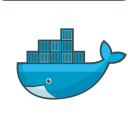

<h2 align="center"> Hey there! I'm Cássio Silva.. 👨‍💻</h2>

<h4 align="center">I'm a computer science and math student working on machine learning. I like chess, rock music and deep neural networks.</h4>

&nbsp;&nbsp;&nbsp;&nbsp;<a href="mailto:cassiossilva07@gmail.com">

-   I'm a rising Junior, studying computer science from distance in USF University of San Francisco 
- 🔭 I'm currently working on personal projects with [Suel]
- 👯 I am always open to discussing new projects, creative ideas, and opportunities.
-  Fun fact: In between training neural networks, I enjoy immersing myself in a game of chess. Feel free to challenge me on <a href="https://chess.com/member/jxdho" target="_blank">Chess<a>.

*Updated 31th July 2025*

<h5 align="center">Language & Tools:</h5>

          

